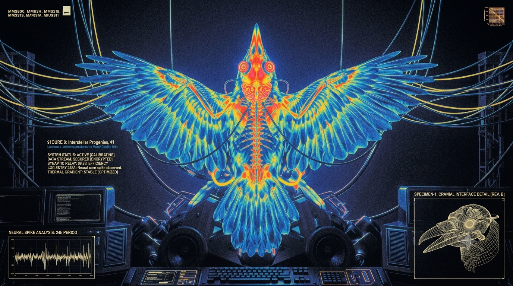

<p align="center">
  
</p>

# Stellar Raven

Stellar Raven is a remote MCP server on Cloudflare Workers. It gives agents two tools over one
catalog of Stellar ecosystem sources: Lumenloop, Stellar Light/Scout, Stellar Docs, and selected
ecosystem skills.

- `search` finds service operations and skills.
- `execute` runs agent-written JavaScript in a Dynamic Worker isolate with no network access.
  Host-side adapters make every service call and hold every secret.

The server instructions also include a generated source-family map. Agents use it to plan which
source family can answer a question.

## Sources and operators

| Source family | Run by | How Raven reads it |
|---|---|---|
| Lumenloop (`lumenloop.*`) | The independent Lumen Loop team ([lumenloop.com](https://lumenloop.com/)) | Its API, with an API key that Lumen Loop issued to Raven |
| Stellar Light/Scout (`scout.*`) | The Stellar Light team ([stellarlight.xyz](https://stellarlight.xyz/)) | Its read-only public API, which it publishes for AI tools and agents |
| Stellar Docs (`stellarDocs.*`) | The Stellar Development Foundation ([developers.stellar.org](https://developers.stellar.org/docs)) | The search index of the official docs site |

Selected ecosystem skills come from Lumen Loop, OpenZeppelin, the Stellar Development Foundation,
Stellar Light, and Trustless Work. Raven pins each source at a reviewed commit, and each skill keeps
its own license. [`ecosystem-skills/README.md`](./ecosystem-skills/README.md) describes the pin set.

## Connect

Add `https://raven.stellar.org/mcp` to an MCP client that supports streamable HTTP and OAuth.
Raven is its own OAuth authorization server, and WorkOS AuthKit handles sign-in. Compatible
clients find and complete this flow automatically. An access token lasts 1 hour. Clients refresh
it automatically for 90 days, then the user signs in again.

| Page | URL |
|---|---|
| User guide and troubleshooting | https://raven.stellar.org/docs |
| Browser Playground | https://raven.stellar.org/playground |
| Terms and privacy | https://raven.stellar.org/terms |
| Health | https://raven.stellar.org/health |

For help, use the `#raven` channel in the
[Stellar Developers Discord](https://discord.gg/stellardev). To report a vulnerability, read
[SECURITY.md](./SECURITY.md).

## Run locally

1. Use Node 24 (`.nvmrc`) and run `npm ci`.
2. Create `.dev.vars` with the variable names in the `.dev.vars` step of
   [`ci.yml`](./.github/workflows/ci.yml). Set `DEV_ALLOW_UNAUTHENTICATED=true` to skip OAuth.
   This bypass works only for the loopback hosts `localhost`, `127.0.0.1`, `::1`, and `[::1]`.
   A Lumenloop call needs a real `LUMENLOOP_API_KEY`. A Stellar Docs call needs real
   `ALGOLIA_APPLICATION_ID_DOCS` and `ALGOLIA_API_KEY_DOCS` values. Without them, the call returns
   an error. A Stellar Light/Scout call needs no key.
3. Run `npm run typegen`. It generates `env.d.ts` from `wrangler.jsonc` and the names in
   `.dev.vars`.
4. Run `npm run dev` and connect a client to `http://localhost:8787/mcp`. Restart the server after
   you edit `.dev.vars`.

The Worker reads `.dev.vars`. Maintenance scripts, such as `scripts/refresh-inventory.mjs`, read
`.env`. Git ignores both files.

## Test

```sh
npm run typecheck   # tsc
npm test            # unit and contract tests (offline)
npm run test:smoke  # the assembled Worker and the Dynamic Worker boundary
npm run build       # dry-run the Worker bundle
```

[`test/README.md`](./test/README.md) maps the test suites.

## Documentation

| Question | Document |
|---|---|
| What is in scope, and which decisions are open? | [PLAN.md](./PLAN.md) |
| How do `search` and `execute` work? | [ARCHITECTURE.md](./ARCHITECTURE.md) |
| How do I deploy and operate Raven? | [docs/operations.md](./docs/operations.md) |
| How is usage counted and retained? | [usage/README.md](./usage/README.md) |
| How do I contribute? | [CONTRIBUTING.md](./CONTRIBUTING.md) |
| How do agents work in this repository? | [AGENTS.md](./AGENTS.md) |
| How do I report a vulnerability? | [SECURITY.md](./SECURITY.md) |

## License

[Apache-2.0](./LICENSE) © 2026 Stellar Development Foundation. Third-party code, fonts, and
upstream skill content keep their own licenses. Read
[THIRD-PARTY-NOTICES.md](./THIRD-PARTY-NOTICES.md).
